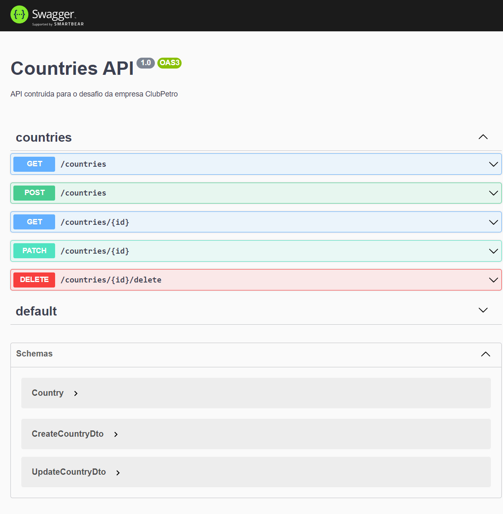
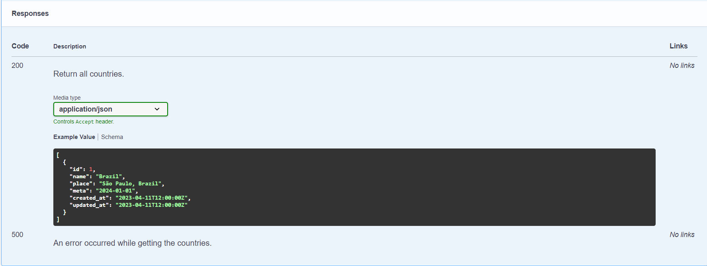
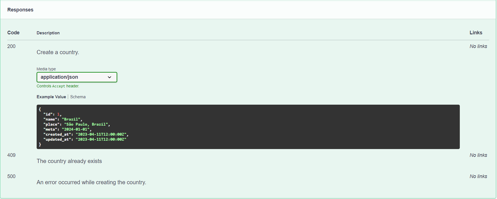
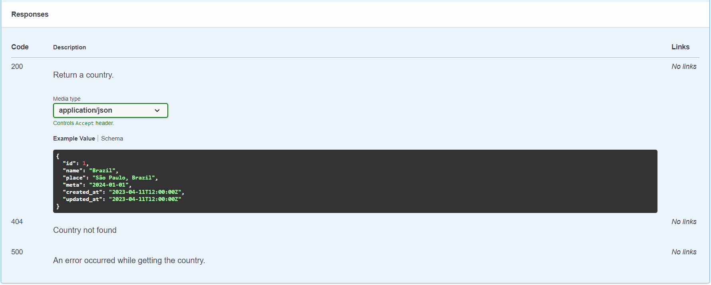
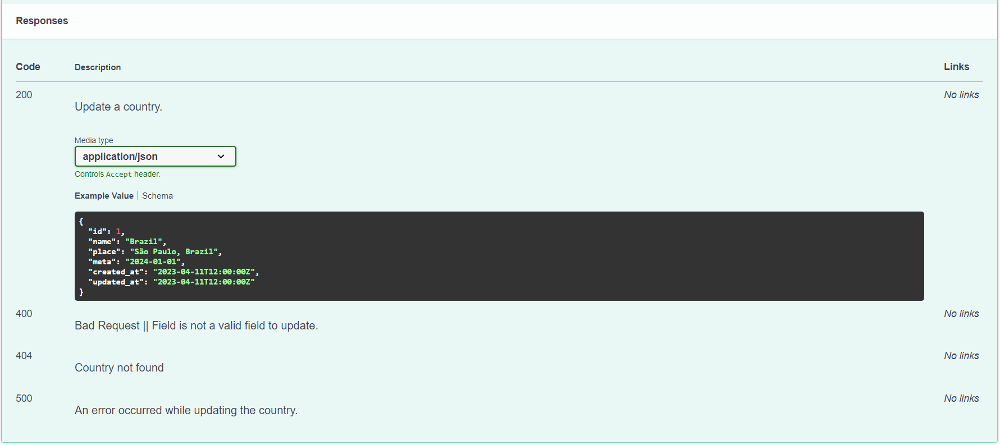
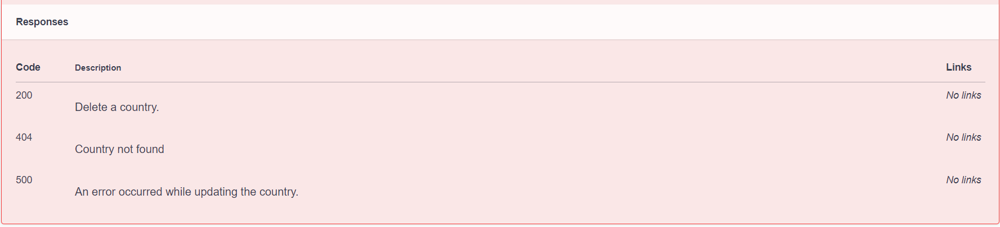

# Desafio de Backend


- [Descrição](#descrição)
  - [O Desafio](#o-desafio)
  - [Tecnologias Utilizadas](#tecnologias-utilizadas)
  - [Requisitos](#requisitos)
  - [Docker Compose](#docker-compose)
  - [Como executar o projeto](#como-executar-o-projeto)
  - [API](#api)
  - [Persistência dos dados](#persistencia-dos-dados)

## Descrição

Este desafio tem como objetivo avaliar as habilidades técnicas do candidato a vaga de desenvolvedor backend no Clubpetro.

#### O Desafio

O desafio consiste em desenvolver uma API rest que permita o CRUD de lugares para se conhecer ao redor do mundo para alimentar o frontend que pode ser visto na imagem a seguir:


Os dados a ser considerados são:

- País: O país escolhido
- Local: O local dentro do país escolhido;
- Meta: O mês e o ano que o usuário pretende visitar o local
- Url da bandeira do país
- Data de criação do registro
- Data de atualização do registro

#### Tecnologias Utilizadas

- <a href="https://docs.docker.com/compose/" target="_blank">Docker</a>
- <a href="https://jestjs.io/pt-BR/" target="_blank">Jest</a>
- <a href="https://nestjs.com/" target="_blank">NestJs</a>
- <a href="https://nodejs.org/en" target="_blank">NodeJs</a>
- <a href="https://www.postgresql.org/" target="_blank">Postgres</a>
- <a href="https://www.pgadmin.org/docs/pgadmin4/latest/index.html" target="_blank">PgAdmin4</a>
- <a href="https://typeorm.io/#/" target="_blank">TypeORM</a>
- <a href="https://www.typescriptlang.org/" target="_blank">TypeScript</a>
- <a href="https://swagger.io/" target="_blank">Swagger</a>

#### Requisitos

- <a href="https://docs.docker.com/" target="_blank">Docker</a>
- <a href="https://docs.docker.com/compose/" target="_blank">Docker Compose</a>
- <a href="https://nodejs.org/en" target="_blank">NodeJs</a>

### Docker Compose


Figura: Composição de Containers

## Como executar o projeto
> O primeiro build pode demorar um pouco

Clone o repositório em sua máquina local:
  ```
  git clone https://github.com/CaioDamascenoAlves/backend-challenge.git
  ```
Acesse o diretório do projeto:
  ```
  cd backend-challenge
  ```
Instale o Yarn:
  ```
  npm install --global yarn
  ```
  ### Como rodar o tests
 [Source code image](https://github.com/CaioDamascenoAlves/backend-challenge/blob/master/img/test_exemple.png)
Inicie os tests:
```
yarn docker-compose:test
```
Inicie o projeto:
```
yarn docker-compose:dev
```
## Requisitos funcionais do desafio

- Apenas o Local e a Meta poderão ser editados;
- O mesmo local em determinado país não poderá ser adicionado de forma duplicada;
- A listagem dos dados deverá ser ordenada de forma crescente pela meta;

Esses requisitos funcionais podem ser testasdos com Swegger de uma maneira simples.

## API
>Se rodar o projeto, acesse a documentação em http://localhost:3000/api através do Swagger.

```
A API do projeto é composta por um microserviço countries. 
O microserviço countries é responsável por criar, listar, deletar e atualizar a tabela country.
```



Figura: Swegger

### Respontas da API

#### @Get




#### @Post




#### @GetById




#### @Patch



#### @Delete




## Persistencia dos Dados:
> Acesse o PgAdmin4 em http://localhost:5050


```
user: admin@admin.com
senha: pgadmin4
```
Ao logar no PgAdmin4 registre um novo server com um nome qualquer e com as configurações do arquivo stage.dev.env


Após essa configuração faça uma consulta na tabela country como:
```
select * from country
```


Perceba que na tabela a apenas uma linha gravada. No seu caso pode ser difirente.

 
