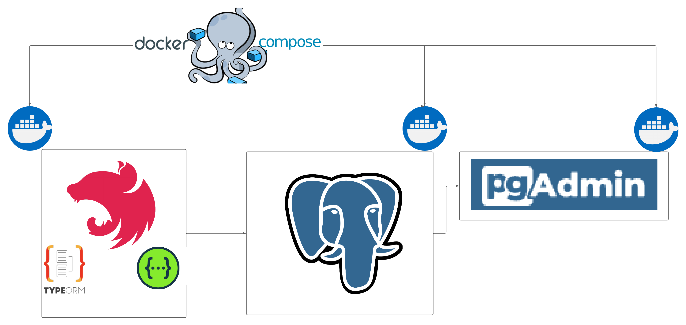
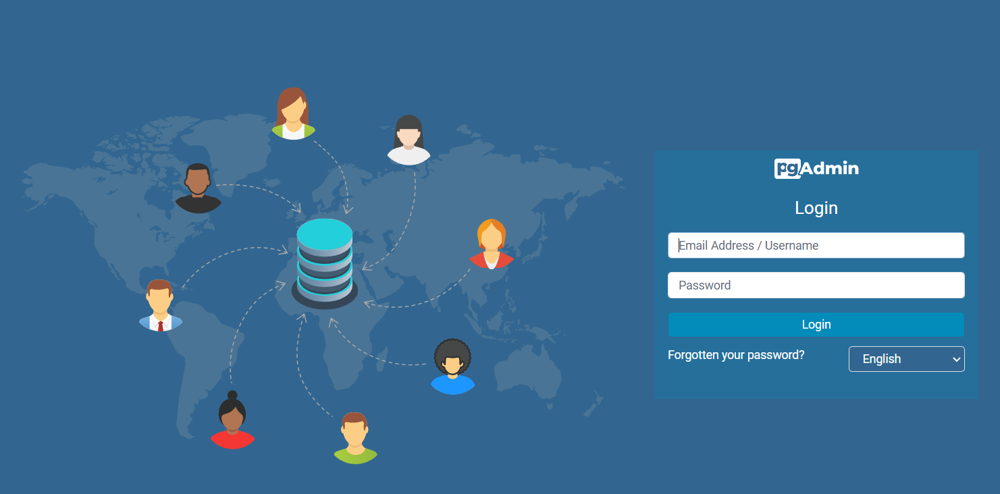
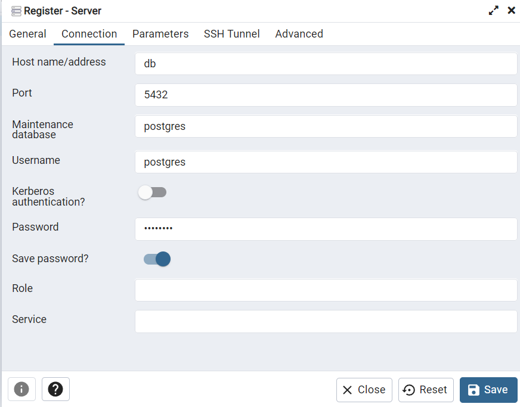
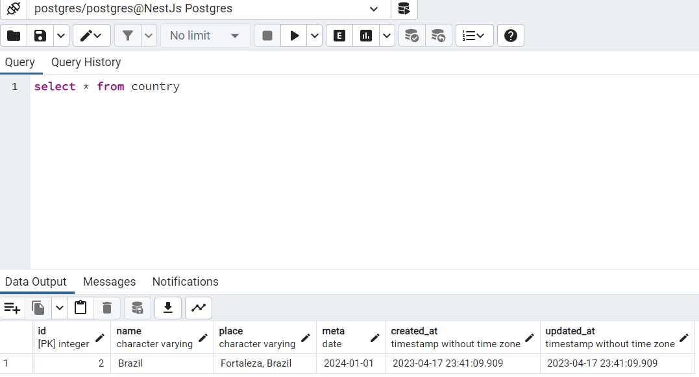

# Desafio de Backend


- [Descrição](#descrição)
  - [O Desafio](#o-desafio)
  - [Tecnologias Utilizadas](#tecnologias-utilizadas)
  - [Requisitos](#requisitos)
  - [Docker Compose](#docker-compose)
  - [Como executar o projeto](#como-executar-o-projeto)
  - [API](#api)
  - [Persistência dos dados](#persistencia-dos-dados)

## Descrição

Este desafio tem como objetivo avaliar as habilidades técnicas do candidato a vaga de desenvolvedor backend no Clubpetro.

#### O Desafio

O desafio consiste em desenvolver uma API rest que permita o CRUD de lugares para se conhecer ao redor do mundo para alimentar o frontend que pode ser visto na imagem a seguir:


Os dados a ser considerados são:

- País: O país escolhido
- Local: O local dentro do país escolhido;
- Meta: O mês e o ano que o usuário pretende visitar o local
- Url da bandeira do país
- Data de criação do registro
- Data de atualização do registro

#### Tecnologias Utilizadas

- [Docker](https://docs.docker.com/compose/)
- [Jest](https://jestjs.io/pt-BR/)
- [NestJs](https://nestjs.com/)
- [NodeJs](https://nodejs.org/en)
- [Postgres](https://www.postgresql.org/)
- [PgAdmin4](https://www.pgadmin.org/docs/pgadmin4/latest/index.html)
- [TypeORM](https://typeorm.io/#/)
- [TypeScript](https://www.typescriptlang.org/)
- [Swegger](https://swagger.io/)

#### Requisitos

- [Docker](https://docs.docker.com/)
- [Docker Compose](https://docs.docker.com/compose/)
- [NodeJs](https://nodejs.org/en)

### Docker Compose
A figura a seguir ilustra a composição de conteineres desenvolvida



### Como executar o projeto
Clone o repositório em sua máquina local:
  ```
  git clone https://github.com/CaioDamascenoAlves/backend-challenge.git
  ```
Acesse o diretório do projeto:
  ```
  cd backend-challenge
  ```
Instale o Yarn:
  ```
  npm install --global yarn
  ```
Criar um arquivo para configurar variaveis de ambiente na raiz do projeto:
  > Nomeie como stage.dev.env
  ```
  PORT=3000
  DB_HOST=DB
  DB_PORT=5432
  DB_USERNAME=postgres
  DB_PASSWORD=postgres
  DB_DATABASE=postgres
  ```
   
Inicie os testes:
> O primeiro build pode demorar um pouco
```
yarn docker-compose:test
```
Inicie o projeto:
```
yarn docker-compose:dev
```
## API
```
A API do projeto é composta por um microserviço countries. 
O microserviço countries é responsável por criar, listar, deletar e atualizar a tabela country.
```
```
A documentação da API pode ser encontrada em http://localhost:3000/api através do Swagger.
```
[Imagem da documentação](https://github.com/CaioDamascenoAlves/backend-challenge/blob/master/img/localhost_3000_api%20full_size.png)

## Persistencia dos Dados:
> Acesse o PgAdmin4 em http://localhost:5050



```
user: admin@admin.com
senha: pgadmin4
```
Ao logar no PgAdmin4 registre um novo server com um nome qualquer e com as configurações do arquivo stage.dev.env



Após essa configuração faça uma consulta na tabela country como:
```
select * from country
```


